<!--
Добрый день, меня зовут Михаил, и недавно я уронил банковский сервер.

А точнее, мой кривой код, попавший в продакшн.
-->
---

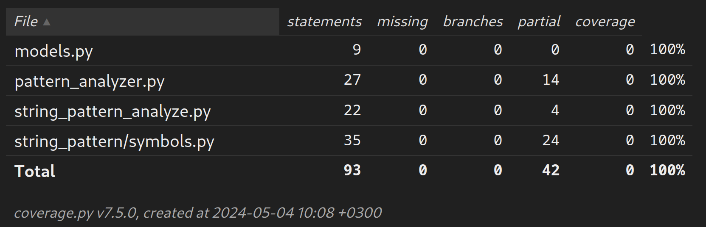

<!--
Код имел 100% покрытие тестами
-->
---

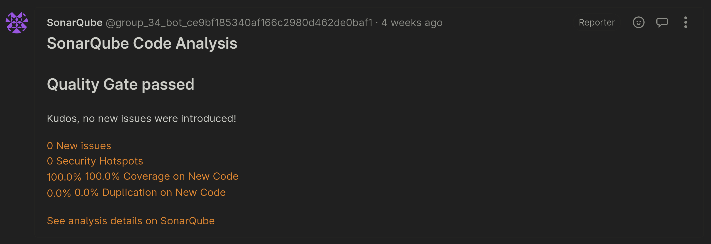

<!--
Прошел проверки линтеров и ревью.
-->
---

<!--
Что же пошло не так? Попробуем разобраться.
-->
---

<!--
На слайде приведен упрощенный код системы и тестов.

Я разрабатывал новую метрику для анализа данных.

Метрики могут быть запущены только через профилировщик.
При запуске профилировщик передает в метрику объект `sample`, содержащий информацию о данных.

Тесты запускают метрику, сравнивают результат с ожидаемым. Результат корректный, все строки кода покрыты тестами.

Но оказалось, что одно из скрытых состояний `sample` приводит к отправке неправильного SQL запроса, который и привел к падению сервера.
-->
---

<!--

Хорошо, тесты не справились. А что насчет ревью? К сожалению, сеньор в это время был в отпуске и ревью проводил тимлид. Он, увидев 100% покрытие и отсутствие замечаний в линтерах, принял мой PR.

Но даже если допустить качественное проведение ревью, для того, чтобы найти такую ошибку, ревьювер должен обладать не меньшим погружением в код, чем его автор, что приведет к двухкратному замедлению разработки.
-->
---

- Coverage не показывает покрытия всех *состояний*
- Тесты сами могут содержать ошибки
- Хорошее ревью требует много усилий

<!--
Итак, мы имеем следующие проблемы:
-->
---

- Coverage не показывает покрытия всех *состояний* :white_check_mark:
- Тесты сами могут содержать ошибки :white_check_mark:
- Хорошее ревью требует много усилий :x:

<!--
И если качественно ревью не уместить в недельный релизный поезд, то остальные проблемы вполне решаемы.
-->
---

- Познаваем ли мир?
- Существует ли Бог?
- **Кто будет тестировать тесты?**

<!--
Так мы подходим к одному из важнейших вопросов философии - кто будет тестировать тесты?

Нам, как разработчикам, хотелось бы иметь инструмент проверки качества наших тестов, и желательно автоматический.
-->
---

<!--
Подход к решению этой проблемы хорошо описывает замечание тимлида к одному из моих PR:
Упадет ли тест, если мы изменим код?
-->
---

1. Берем код, успешно прошедший тесты
2. Вносим небольшие изменения (мутанты)
3. Запускаем тесты снова

<!--
Таким образом, план действий следующий:
-->
---

:white_check_mark: Тесты упали (мутант убит)

:x: Тесты все еще успешны (мутант выжил)

<!--
Тесты упали - хорошо, они отреагировали на неправильное поведение
Тесты не упали - плохо, тесты не покрывают этот случай или имеют ошибку
-->
---

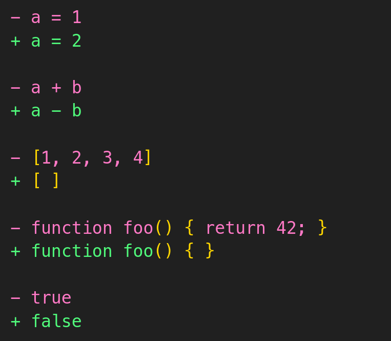
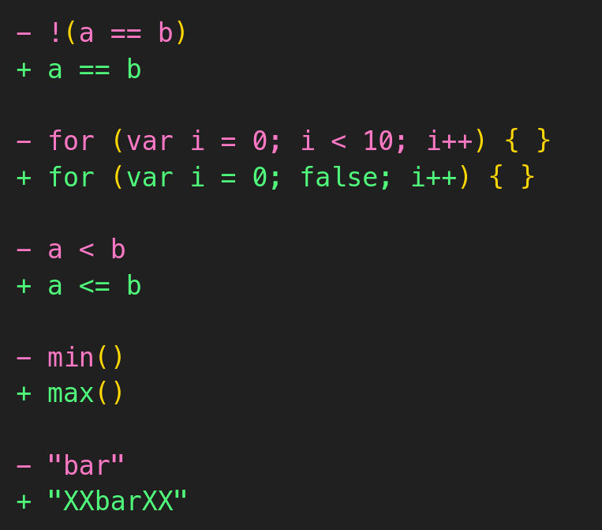

<!--
Ключевым при таком подходе является выбор внесенных изменений.
Они должны менять поведение программы, но не приводить к ошибкам компиляции.
Так же не очень практично менять весь код сразу, внесение ошибок по одной позволит лучше понять, какие случаи не покрыты тестами.

Среди таких изменений могут быть:
- Арифметические операторы
- Литералы
- Функции
- Логические выражения
- и другие
-->
---

## Мутационное тестирование

<!--
Поздравляю, только что мы изобрели мутационное тестирование!

Технология мутационного тестирования существует с 1971 года, но до недавнего времени не была широко распространена, так как требует больших вычислительных ресурсов.

Мы уже рассмотрели, какие проблемы она решает и как работает. Теперь давайте посмотрим, как применять ее на практике.
-->
---

- PITest (Java)
- Stryker (JS, .NET, Scala)
- MutMut (Python)

<!--
Несмотря на небольшую популярность данного подхода, почти для каждого языка программирования существует свой инструмент мутационного тестирования. Самые популярные и продвинутые из них приведены на слайде, но все они работают по тому же принципу, что мы описали ранее.
-->
---

<!--
Что ж, давайте попробуем применить мутационное тестирование на практике.
-->

---

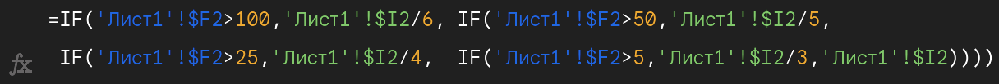

<!--
Для примера возьмем один из моих проектов - программу для логистичекой компании.

ТЗ пришло в виде Excel файла с набором подобных страшных формул.
-->
---

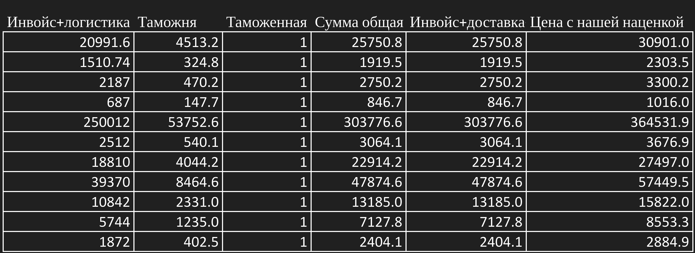

<!--
Но к счастью, это означает что у нас есть данные для тестирования.
-->
---

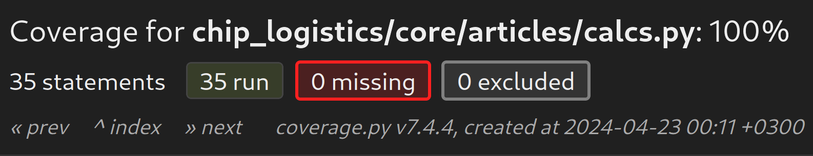

<!--
Сначала напишем тесты, затем код, который будет их проходить, Test Driven Development и все такое.

Тесты прошли, покрытие 100%, все хорошо. Так ли это?
-->
---

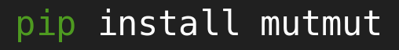

<!--
Проверим качество наших тестов с помощью мутационного тестирования.
Для этого воспользуемся библиотекой mutmut.
-->
---

<!--
Для запуска используем команду run.
-->
---

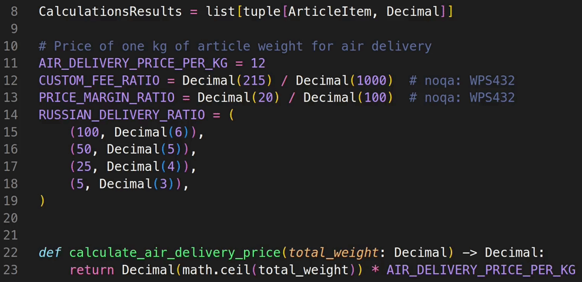

<!--
Если открыть файл, то можно вживую увидеть, как в код вносятся мутации.

После каждой мутации mutmut снова запускает тесты, поэтому процесс может занять некоторое время.
-->
---

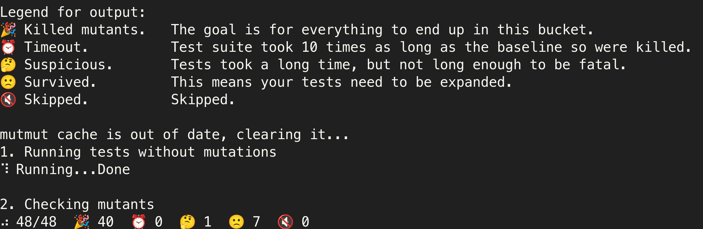

<!--
После завершения работы получаем результат.

В нашем случае было сделано 48 мутаций, из которых 7 выжили.

Сформируем отчет с помощью команды html и рассмотрим их.
-->
---

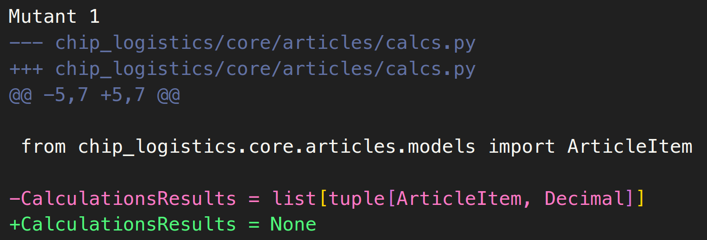

<!--
И первое же срабатывание оказалось ложным.

Мутация изменила type alias, что никак не повлияло на работу программы.
-->
---

<!--
В таких случаях можно указать, что строку не нужно мутировать при помощи специальных комментариев.

mutmut также предоставляет уникальную фичу, позволяющую написать функцию, которая будет запускаться перед каждой мутацией.
Это позволяет пропустить определенный код или добавить свои собственные мутации.
-->
---

<!--
Следующие 4 мутации схожи между собой.

Они немного изменяют константы в формулах.
И на удивление, тесты не отлавливают этих, казалось бы существенных, изменений.

Взглянув на код, замечаю, что результаты вычислений округляется, чтобы соответствовать формату Excel,
но тесты не проверяют значение до округления.
-->
---

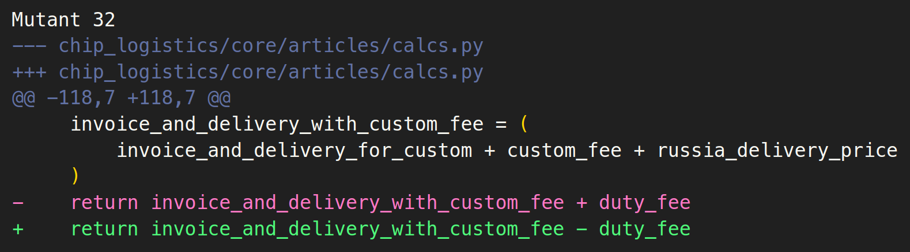

<!--
Изменения формулы расчета таможенной пошлины также не повлияли на результаты тестов.

Вспоминаю, что заказчик вносил правки в ТЗ и попросил отключить таможенную пошлину.
Но вместо того, чтобы изменить код, я захардкодил в тестах и коде значение 0.
-->
---

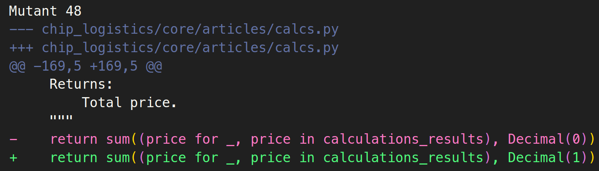

<!--
И последняя мутация выявила, что подсчет суммарной стоимости вообще не проверяется в тестах,
а coverage берется из-за вызова функции в другом модуле.
-->
---

1. Некачественные тесты
2. Расхождение тестов и спецификации
3. Неполное покрытие

<!--
Итак, мутационное тестирование позволило нам выявить следующие проблемы:

Но если мутационное тестирование так хорошо решает проблему качества тестов, почему оно не стало стандартом в разработке ПО?
-->
---

- Ложные срабатывания
- Длительное время выполнения

<!--
Я думаю, вы уже заметили, что данный подход обладает существенными недостатками.

Во-первых, это ложные срабатывания. При попытке полной автоматизации, в большом проекте код быстро зарастет комментариями для отключения мутаций.

Во-вторых, длительное время выполнения. Если ваши тесты занимают минуту и сделать нужно всего 1000 мутаций, то весь цикл займет 16 часов.
-->
---

<!--
Удачи мутировать все исходники Windows, через 50 лет расскажите, что получилось.
-->
---

Мутируйте покрытый тестами код

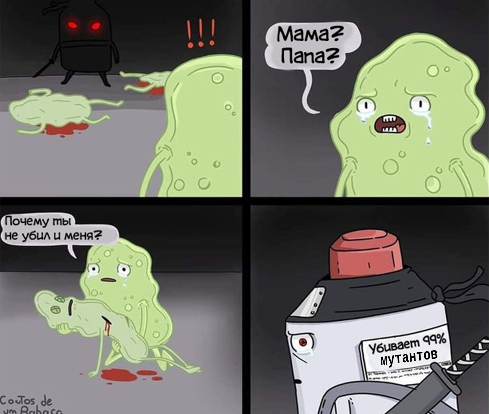

<!--
Единого подхода к тому, как внедрять мутационное тестирование в процесс разработки, нет, но я выделил несколько полезных советов:

Нет смысла мутировать код, не покрытый тестами, такие мутанты всегда будут выживать.

Большинство популярных инструментов мутационного тестирования позволяют использовать информацию о кавередже для запуска тестов только на покрытом коде.
-->
---

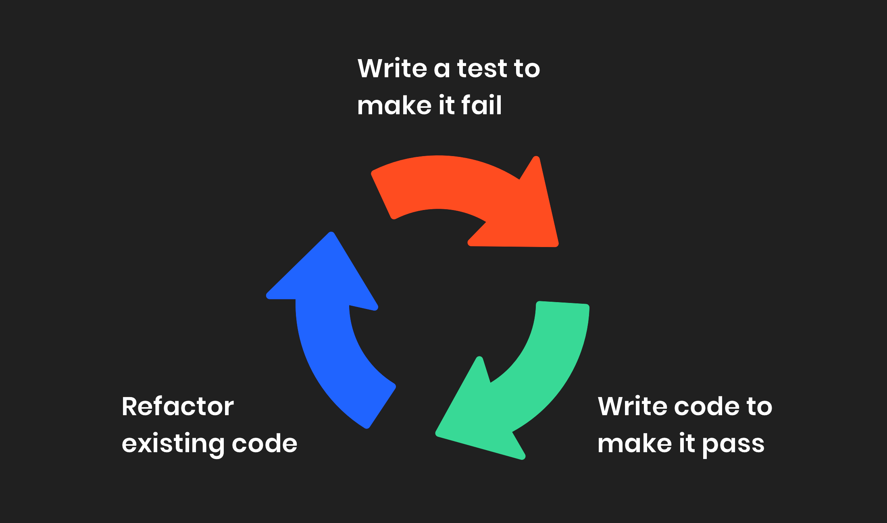

<!--
Вместо того, чтобы днями гонять мутационное тестирование на всей кодовой базе, можно применять его только к новому коду.
Это сократит время выполнения до разумного, а в мастер всегда будут попадать только качественные тесты.
К тому же, такой подход идеально сочетается с Test Driven Development.
-->
---

## Что дальше?

<!--
Итак, мы рассмотрели, что такое мутационное тестирование, как оно работает и как его применять на практике.
-->
---

- Stryker Playground
- Никита Соболев, "Убивай мутантов, спаси свой код"
- Automated Unit Test Improvement using Large Language Models
at Meta*

<!-- _footer: ! *Цукерберг террорист  -->

<!--
Если вам интересно попробовать мутационное тестирование, то рекомендую воспользоваться Stryker Playground, где можно попробовать мутационное тестирование в браузере.

Также советую посмотреть доклад Никиты Соболева, некоторые детали у него освещены более подробно.

И еще одно интересное применение мутационного тестирования, о котором тоже стоит почитать - использование его для автоматической генерации тестов при помощи больших лингвистических моделей. У компании Meta недавно вышло исследование на эту тему. Мутационное тестирование они использовали для отсеивания некачественных тестов.
-->
---

# не забудь скинуть ссылку на github!!!

<!--
Ссылку на репозиторий доклада я сейчас скину в чат, там будут все упомянутые материалы.

Спасибо за внимание и надеюсь у нас осталось время на вопросы.
-->
